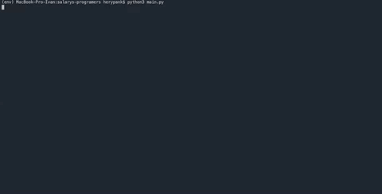

# salaries-programers
 
## Описание проекта.   
Этот проект позволяет узнать среднюю зарплату программистов в Москве через API: HeadHunter и SuperJob.
   
## Пример использования.   

 
## Подготовка к запуску.  (Linux or MacOS)
Уставновить Python 3+.
```
sudo apt-get install python3
```
Установить, создать и активировать виртуальное окружение.
```
pip3 install virtualenv
python3 -m venv env
source env/bin/activate
```
Установить библиотеки командой.  
```
pip3 install -r requirements.txt
```
Создайте файл .env в него надо прописать ваш SuperJob token в переменную **SJ_TOKEN** его можно получить [**тут**](https://api.superjob.ru/).  
    
**Пример заполнения .env файла**        
```
SJ_TOKEN=v3.r.132760579.d32e4e46e08879a84f59239c248bd044ae5cd92c.9aee469a67de819b18d36a46489e329c118d0d20
```
# Аргументы.
**prog_language** — Дополнительные языки программирования.   
**skip_hh** - Не делать таблицу hh.   
**skip_sj** - Не делать таблицу sj.   

```
python3 main.py PHP Pascal
```
## Запуск кода.  
```
python3 main.py
```
